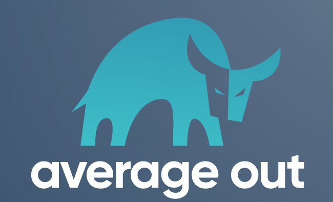

# Average Out

## A cryptocurrency portfolio tracker and strategic exit application for selling across multiple assets.

## Description

_Duration: 2 Week Sprint_

Average out is an all-in-one cryptocurrency portfolio tracker and strategic exit application that allows users to calculate different selling scenarios across multiple assets.  

With the massive rise in popularity of cryptocurrency, the world has become saturated with a countless number of exchanges, platforms and applications that allow people to get involved in the crypto scene.  What these platforms all lack is the ability to help an investor exit their positions in a strategic way.

Average Out was built with the seller in mind.  

Looking to hit a target return selling across multiple assets?  Let us handle the calculations and tell you EXACTLY how much to sell of each asset based on live market data.  

Want to extend your sale over a set duration and not try to time the market?  Average out can handle running your active exit strategies for whatever duration you choose.

Please note that Average Out is a work in progress and features are being added all the time!  If you have any questions or concerns, please feel free to reach out to me in the contact section at the bottom of the readme.

## Screen Capture

### Watch a full demo of the app on YouTube!

### Prerequisites

#### Deployed Version
- Please note this app was created for mobile, so if using a desktop I would recommend using chrome dev tools and resizing your browser window to iPhoneXR or iPhone12.

<a href="https://average-out.herokuapp.com/">Average Out On Heroku</a>

#### For installing on local machine:

- Internet Browser
- Node.js
- Express
- Database GUI (e.g. Postico)
- PostgreSQL

## Installation

- Run npm install --yes in terminal to install all necessary dependencies.
- To setup the database locally, please see the database.sql file for instructions.

## Usage

1. Scroll through the movie list on the home page.
2. If a movie interests you, click on it for more details!
3. Click the "Edit Movie" button to change the title or description
4. Click the "Add To Watchlist" button to save the movie to your watchlist.
5. Click on a specific genre in the movie details view to see other movies that share that genre.
6. Add a movie by clicking on the plus button at the bottom of the app.
7. View your watchlist by clicking on the watchlist icon at the bottom of the app.

## Built With

>

- Javascript
- React
- Redux
- Sagas
- Node.js
- Express
- PostgreSQL
- Material UI
- HTML
- CSS

## Acknowledgement

Thanks to [Prime Digital Academy](www.primeacademy.io) who equipped and helped me to make this application a reality. 

Thanks to everyone in the Adam's Cohort for being such a great group of individuals!

Special thanks to my wife, Allison, for being my UI tester!

## Support

If you have suggestions or issues, please feel free to contact me!

  

